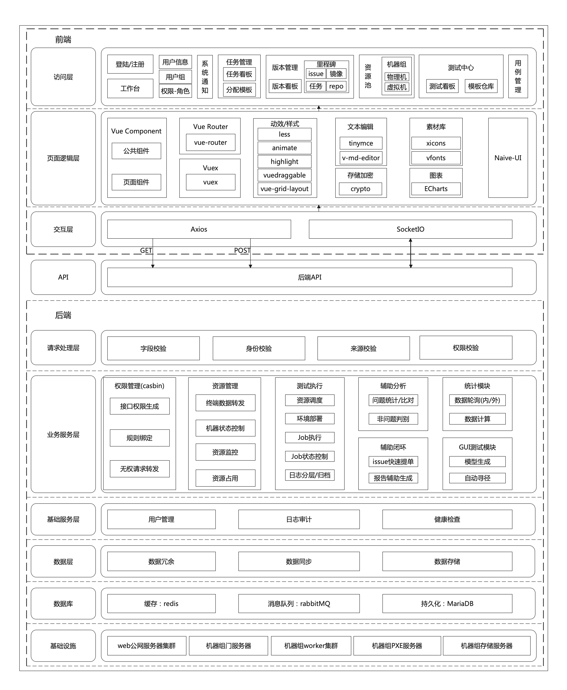
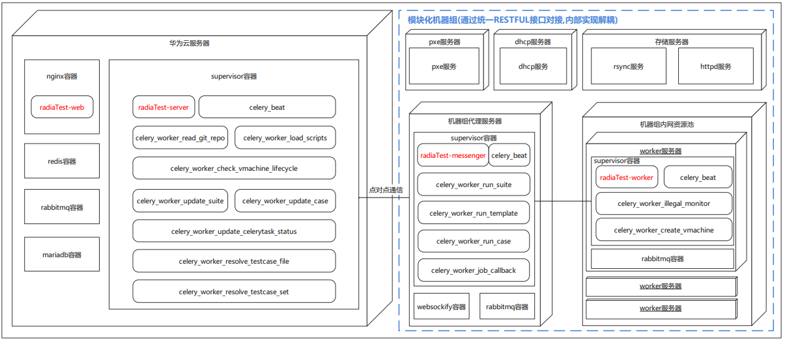
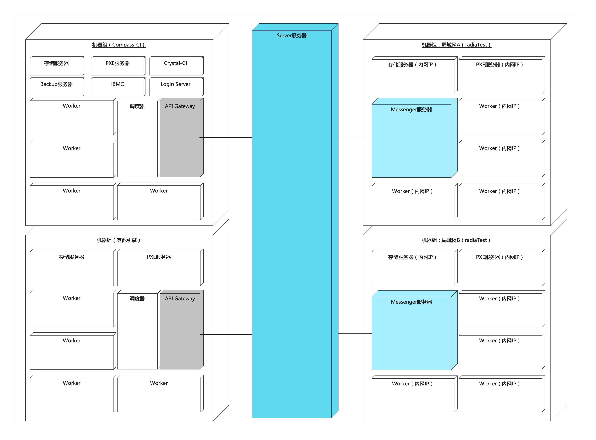
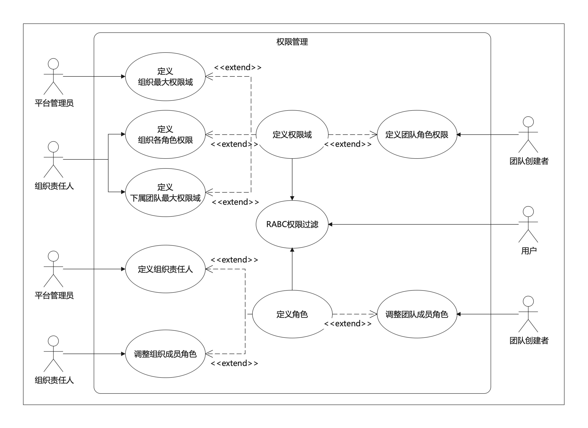
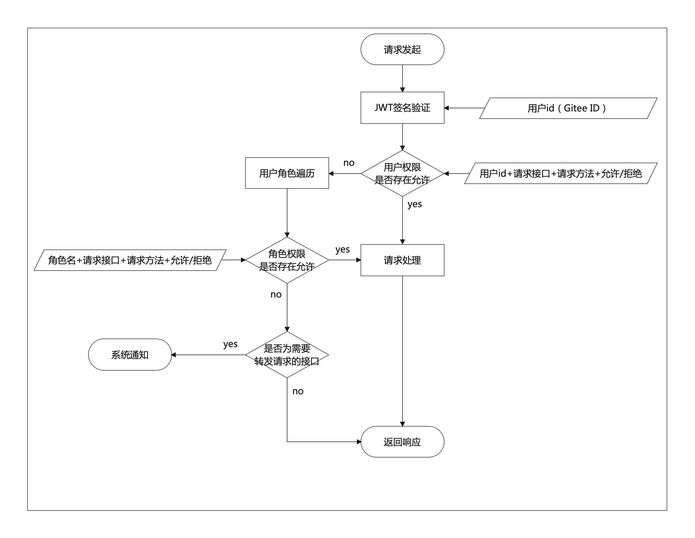

#  需求描述

​	鉴于质量要求，openEuler的update版本当前CVE修复验证和发布以周为单位，频率较高。且openEuler迭代版本的测试尤其环境部署及执行方面是半自动化的，缺少一套对环境、版本规划测试任务及任务执行、文本测试用例管理、以及测试开发日和bug发现日的系统平台。除此之外，统信测试人员一直询问社区是否接收文本测试用例，但社区目前不具备对文本测试用例的管理能力。

​	当前openEuler维护3个版本LTS、LTS-SP1、LTS-SP2的update发布，需要投入2.5人月人力，但未来随着SP3的发布，对测试人力的占用会更大。在版本测试中，虽然自动化率已经达到90%，但是实际版本测试活动中，一套环境的部署还是手动(ISO镜像下载大概5小时以上，物理机安装部署大概半小时)或者半自动化(虚拟机部署15分钟)。自动化用例的执行还需要手动进行代码下载、执行及结果的统计与分析，仍有效率提升的空间。除此之外，版本迭代测试任务没有统一的任务过程跟踪及整体管理体系。综上所述，开展各类社区测试活动缺少一个可支持的测试平台。

​	radiaTest测试平台可以满足openEuler各类版本的实际测试需求，以版本、资源、任务、执行、用例五个维度使能高效测试活动。可以根据实际版本测试任务，进行测试任务的定制，并与里程碑相关联，方便版本测试的跟踪管理。可以满足社区对文本用例的管理。可提供分布式的资源管理、测试任务管理能力。为未来规划的社区测试开放日、bug发现日等活动提供测试平台能力。

​	高效性使版本测试人力投入得以节省，易用性使社区吸引更多其他开发者（OSV&个人）向社区贡献，并且社区化的测试管理使社区测试生态不断提升。


## 1.1、 受益人

| 角色     | 角色描述                           |
| -------- | ---------------------------------- |
| 测试人员 | 根据测试任务负责用例执行的人员     |
| 测试经理 | 负责管理版本、资源、测试任务的人员 |

## 1.2、依赖组件

| 组件           | 组件描述           | 可获得性                        |
| -------------- | ------------------ | ------------------------------- |
| python3-devel  | python3开发组件    | 使用openEuler repo源dnf install |
| docker         | 容器引擎           | 使用openEuler repo源dnf install |
| docker-compose | 容器部署工具       | 使用openEuler repo源dnf install |
| tar            | 归档打包组件       | 使用openEuler repo源dnf install |
| nodejs         | JavaScript运行环境 | 从nodejs官网获取二进制包        |
| libvirt        | 虚拟化组件         | 使用openEuler repo源dnf install |
| virt-install   | 虚拟化组件         | 使用openEuler repo源dnf install |
| ipmitool       | bmc远程操作工具    | 使用openEuler repo源dnf install |
| mariadb        | 关系型数据库       | 使用openEuler repo源dnf install |
| nginx          | web服务器          | 使用openEuler repo源dnf install |
| rsync          | 日志同步工具       | 使用openEuler repo源dnf install |


## 1.3、License

Mulan V2

# 2、设计概述

## 2.1、 分析思路

## 2.2、设计原则

- 前后端分离：前后端代码技术上进行分离，两者基于设计好的数据接口交互，使项目开发和测试并行推进。
- 数据与代码分离：将需求动态改变的数据提取到配置文件，而非用硬编码写死在代码中
- 接口与实现分离：外部依赖模块接口而非依赖模块实现
- 模块划分：模块之间只能单向调用，不能存在循环依赖

# 3、 需求分析

## 3.1、架构设计

#### 3.1.1、radiaTest平台软件架构

radiaTest采用前后端分离的模式，前端采用vue3框架js实现，后端采用flask框架python实现，通过http请求和websocket进行通信。

- UI主色为克莱因蓝#012fa6，辅色为浅灰色#f2f2f2，背景色为白色#ffffff。
- web页面通过Nginx进行部署，通过反向代理访问后台服务http接口，websocket涉及多对象，采取直连。
- 采用ORM的数据存储架构，牺牲部分性能保证安全性和代码的低编写门槛。
- 权限角色管理采用Casbin框架，权限为基于接口访问动作的权限，不涉及页面的组件过滤。页面的内容过滤通过强逻辑硬性过滤。
- 用户身份统一来源于Gitee身份鉴权，自身仅构建平台管理员的身份鉴别能力。
- 数据存储（持久化/缓存）采用主备机制，分布式部署，增加平台数据鲁棒性
- 消息队列为节点本地的异步任务队列，不涉及非本机通信
- 平台具备相对完整的日志审计和健康检查的体系，支撑运维。



#### 3.1.2、radiaTest部署架构

radiaTest主体为web服务的前后端模块，辅以部署于接入网段入口节点的转发服务和部署于工作节点的worker服务。

- web服务的前后端模块分别对应源码结构中的radiaTest-web和radiaTest-server，转发服务为radiaTest-messenger，worker服务为radiaTest-worker。
- radiaTest-web、radiaTest-server、radiaTest-messenger以容器进行部署，radiaTest-worker以supervisord直接部署在裸金属节点。
- messenger + N*worker即为平台接入的单个模块机器组，可复数接入，对worker实际发送请求对来源为转发服务messenger。
- messenger需要部署于机器组具备公网通信能力的节点上，确保与server端的一对一安全通信。每一个机器组都支持使用自身的dhcp和pxe服务等服务


##### 3.1.2.1、基于平台自有服务、单机器组接入的部署视图



##### 3.1.2.2、基于多元化测试服务、多机器组接入的部署视图




### 3.2.1 用户管理

#### 3.2.1.1 用户鉴权

- 模块介绍

  平台中注册的组织拥有是否具备Gitee企业仓和是否要求签署CLA两个属性，决定了鉴权流程的差异。

  - 对于具备企业仓组织，用户鉴权将基于对应企业仓已注册应用的Oauth鉴权，不属于该企业仓的码云户将无法登陆；而对于不具备企业仓的组织，用户鉴权将基于Gitee社区注册的公共应用的Oauth鉴权，所有码云用户都可以通过鉴权
  - 对于要求签署CLA的组织，若用户邮箱CLA签署验证失败，则跳转组织注册的CLA签署页面，用户签署后重填邮箱重新验证。
  - 支持同时注册第三方关联平台的帐户绑定/注册，以支撑平台使用过程中所需的三方用户验证，如Compass-CI帐户。
  - 注册通过后用户的相关数据将入库存储，使能用户二次登陆跳过前述流程

- 业务流图

  

  

#### 3.2.1.2 用户组

- 用户组分为组织、团队两个级别

  - 组织无法由用户创建，必须通过平台管理员创建并分配组织管理员权限。组织的企业仓、CLA属性决定了组织下用户鉴权的流程。
  - 组织管理员可自由对组织内成员角色进行调整，对组织下权限规则进行管理。
  - 组织和Gitee开源社区为同级对应关系，如openEuler、openGauss等，但平台不对此进行硬性设置。

  - 任意用户可以创建团队，团队归属于用户当前登陆状态归属的组织。用户可以自由对团队内成员进行用户邀请删除、角色调整和权限规则管理。


#### 3.2.1.3 权限：规则与角色

接口访问规则与角色的绑定，角色与用户的绑定，决定了用户的权限

- 接口访问规则

  - 默认接口访问规则由配置文件定义的范围自动生成
  - 创建接口对应的新增规则由接口的配置文件自动生成
  - 单一规则为单一接口单一行为（CRUD）允许访问或者拒绝访问
  - 规则需与角色绑定生效，判别基于Casbin配置文件定义的允许-拒绝模型，即存在允许且不存在拒绝则通过
  
- 角色

  - 角色分为团队、组织、公共三个类型
  - 自有角色由配置文件定义自动生成，分为管理员角色、一般角色和默认分配角色三类
  - 拥有角色管理权限的用户可以对非自有角色进行管理，不可删除平台自有角色
  - 角色存在继承关系，父角色拥有的权限子角色也会拥有，子角色拥有的权限父角色不一定拥有
  - 各范围的默认角色为根角色，管理员及其他角色均为默认角色的派生角色

- 权限

  - 团队、组织、公共的默认权限由配置文件规定，有权限变更权限的角色同时可以对此类权限进行编辑
  - 创建者将自动获取被创建对象的所有权限，基于创建时选择的权限归属同时会将相应权限归属于指定团队/组织/公共的管理员角色
  - 个人权限均为平台自动管控，不支持用户自主管理。

- 用例视图

  

- 业务流图

  

  

#### 3.2.1.3 系统通知

- 模块介绍

  当涉及组织、团队、个人的事务发生后，如团队邀请通知、任务分配通知、机器到期通知、任务执行通知和执行结果通知等，平台具备单对单和单对多的通知生成与分发能力，且历史通知可以查询

  - 无权的接口访问均会创造相应请求的系统通知，并发送至被请求对象权限归属范围的管理员角色用户，若管理员同意，该请求的后续逻辑才被接口实现。
  - 系统通知分为脚本和文本两类，文本类型承载纯粹的通知，脚本类型承载带有同意和拒绝的通知。
  
- 业务流图

  

  

### 3.2.2 版本管理

* 模块介绍

  通过对社区发布版本、版本里程碑的管理，实现社区测试的透明化，实现测试流程可跟踪可追溯

  - 具备发布版本实时质量看板，承载版本实时各项数据统计和可视化，以及周期性质量看护（如性能、兼容性）
  - 对于具备企业仓的组织，支持同步管理Gitee里程碑以及其issues等内容
  - 通过绑定相应版本的镜像和REPO数据，支撑平台通过里程碑自动获取相应环境

* 业务流图

  <!--待补充-->

  

### 3.2.3 资源池

radiaTest平台除了具备自有资源池，同时支持各基于不同测试引擎的资源池进行接入，通过约定的API Gateway进行请求对接、数据回填

- 资源池的定义为，使用同一测试引擎/服务群的复数广域网/局域网机器组

- 机器组的定义为，基于同一dhcp服务，同一pxe服务的，与平台注册于同一被注册机器组的机器群体。

  

#### 3.2.3.1 radiaTest自有资源池

- 模块介绍
  - 机器分为物理机、虚拟机、Docker三种类型，其中虚拟机为动态资源，物理机和Docker为静态资源
  - 新增虚拟机将于宿主用途的物理机上进行实际创建，且虚拟机均具有临时性
  - 支持对虚拟机的配置、网卡、磁盘等项进行管理，平台提供基于vnc的虚拟机web控制台
  - 物理机与Docker仅支持现有资源的纯数据注册，对物理机和Docker的占用将反应于ssh临时密码机制 
  - 静态资源被占用时，平台将生成的随机ssh密码替换其原有密码，并在释放时间到达后再次随机生成替换，ssh密码仅占用人可见
  - 静态资源owner可以自由修改登陆密码，修改后将强制释放该静态资源

  

- 用例视图

  

#### 3.2.3.2 第三方接入资源池

- 模块介绍
  - 对接第三方平台的资源借用/释放能力，基于约定的API Gateway访问对应接口发出请求，基于约定的返回接口获取回传数据，身份认证基于用户绑定第三方平台用户后储存的相关凭据
  - 第三方资源池接入是第三方测试引擎接入的基础，用以支撑第三方平台的资源调度、环境部署与测试执行能力等


### 3.2.4 用例管理

#### 3.2.4.1 文本用例管理

* 模块介绍

  全量承载社区文本用例资产，将离散化的社区文本用例基础设施统一，提供社区文本用例管理全流程作业能力。

  - 具备基于统一格式，由现有文件导入文本用例的能力，使能用户高效迁移用例资产
  - 具备将文本用例数据导出为制定文件格式的能力，支撑用户多元化存储诉求
  - 构建用例评审作业流，避免文本用例被随意修改，保障文本用例质量，使能用例历史版本可追溯。

* 用例视图

  

  

#### 3.2.4.2 用例集与测试策略管理

- 模块介绍

  用例集以团队为单位存储，为团队的用例总集合，是该团队制定测试策略时选取关联用例的基础。同一组织下，不同团队用例集的总集合即为组织/社区的用例总仓，组织的用例总仓为组织下用户在执行测试和测试任务管理中提供关联依据。用例集中的测试套节点展示测试套所测对象的rpm信息等文本数据，测试用例节点展示该用例的用例详情、历史版本、历史执行记录以及自动化脚本代码。

  测试策略以团队为域，是用例集的子集。测试策略创建需要关联某一里程碑，关联的用例具备执行状态/执行结果。用户可以创建基于测试策略的任务，该任务中涵盖该策略中的所有关联用例，最新关联任务中的用例执行结果将同步到策略的关联用例结果。测试策略详情中展示最新关联任务实时状态以及测试策略相关背景描述。

- 用例视图

  


#### 3.2.4.2 框架适配器

- 模块介绍

  平台自有的测试执行模块采用对象适配器设计模式实现多框架适配。

  基于当前请求的测试框架名称，获取对应框架类，然后使用该框架类的执行器、日志解析器实例实现执行适配器以及日志解析适配器，并于测试执行过程中使用执行适配器和日志解析适配器的实例。

  用户可基于Executor、LogResolver抽象接口类编写待适配框架的实现，并于相应框架类中实例化该实现，并记录于框架映射类中完成框架适配流程。

- 类图

  


#### 3.2.4.3 自动化脚本定时存储与解析

- 模块介绍

  平台默认每30分钟异步爬取一轮已注册的测试代码仓库，并基于测试代码仓所属的测试框架适配执行器中定义的方法解析存储测试用例的环境需求信息。每轮数据爬取和解析时保证一定并发量，保证数据同步总耗时相对最低。

  自动化脚本代码数据用以支撑三方面的用途

- 用例视图

  


### 3.2.5 任务管理

* 模块介绍

  任务是团队/组织进行测试作业管理的基础载体，其关联着版本的里程碑、待测范围、报告和任务的责任与协助人员，用户可以通过任务管理一站式完成任务的分配、通知、进度看护、报告编写等行为。

  任务分为测试执行任务以及测试管理任务。测试执行任务区分架构，若测试执行任务中关联了自动化用例，当任务处于执行中状态时其中自动化用例将自动打包测试模板并执行，最后自动回填结果；测试管理任务可为任意非执行类任务，是版本测试需求任务的载体，测试需求的通过率等同于测试需求任务的完成率。

  任务默认存在待办中、进行中、执行中、已执行和已完成5种状态，支持自定义状态以及状态链顺序，但无法对默认5种状态进行任何变更。执行中和已完成为特殊状态泳道，存在周边模块协同。

* 用例视图

  

#### 3.2.5.1 执行中状态任务关联的自动化用例自动执行

* 模块介绍

  当测试执行类任务状态变更为执行中时，其中关联的自动化用例将被打包为一个任务类型的测试模板，并自动触发执行。执行完成后，对应自动化用例的执行结果将自动回填。若该任务仅由自动化用例组成，其将在执行完成后自动置为已执行状态，否则需要所有关联用例均获得结果才可以手动置于已执行状态。测试管理类任务状态变更为执行中不存在额外触发的流程。

* 业务流图

  


#### 3.2.5.2 测试报告非主观内容自动化填充


### 3.2.6 测试中心

测试中心对外呈现自动化测试的执行服务，包含资源的调度与环境的部署，具体由radiaTest自身及第三方测试服务多元化实现，使能满足不同业务诉求。

基于接入的资源池种类，测试中心提供多选择的测试执行方案，不局限于单一平台完成作业。前端的状态控制、进度监控、结果查询均采用同一页面与样式展现。

- 用例视图

  


#### 3.2.6.1 radiaTest自有测试执行

以平台存储的框架适配器、自动化代码测试环境需求、镜像信息等数据为数据基础，以celery框架为异步并发基座，基于原生paramiko实现资源调度、环境部署、测试执行到日志回传解析到完整作业流。


##### 3.2.6.1.1 资源调度

- 模块介绍

- 业务流图

  

##### 3.2.6.1.2 测试执行

- 模块介绍

* 业务流图


##### 3.2.6.1.3 非问题判别

- 模块介绍

- 业务流图


##### 3.2.6.1.4 issue快速提单

- 模块介绍
- 业务流图


### 3.2.7 外部工程对接

#### 3.2.7.1 openEuler社区update周版本测试验证

- 模块介绍
- 业务流图


## 3.5、 DFX分析

### 3.5.1、 性能规格

| 规格名称 | 规格指标 |
| -------- | -------- |
| 内存占用 |          |
| 启动时间 |          |
| 响应时间 |          |

### 3.5.2、 系统可靠性设计

1. 数据库：

   基于华为云提供的具备完善主备机制的持久化/缓存数据库，保障数据可靠性。

2. 异常情况：

   真实节点部署：基于docker-compose工具以及supervisord服务对异常关闭的服务进行自动重启。

   kubernetes-pod部署：基于k8s实现弹性扩容和异常关闭自动重启。

3. 数据库部署：

   持久化/缓存数据库单独部署在独立存储节点，使用更大的带宽，保障对主数据库的访问不因流量高峰阻塞

4. 多请求并发场景处理方：

   web服务分布式部署于多个节点，通过负载均衡支撑高流量场景；使用gunicorn（多进程+gevent协程）启动web后端应用，支撑处理高并发场景。处理时间高于秒级的接口利用celery实现异步并发，支撑平台秒级响应。

### 3.5.3、 安全性设计

- 数据库依赖于华为云的数据库服务，由华为云提供成熟的KMS密钥管理服务
- 密文传输采用RSA256非对称加密，避免后端服务传输密文过程中遭遇数据劫持
- 对外服务采用https协议通信
- 权限管理模块纳管所有接口，最小粒度保证访问合法

### 3.5.4、 兼容性设计

- 通过统一API Gateway访问第三方平台的服务，屏蔽第三方平台中复杂的调用关系。

- 对外接口只能增量变化，新版本保证旧版本接口可用。

- 采用ORM，数据库的变更对外不体现，由代码逻辑保证可用性。

### 3.5.5、 可服务性设计

### 3.5.6、 可测试性设计

## 3.6、 特性清单

<!--需要更新-->

| no   | 一级需求      | 二级需求                                                           | 预计工作量 | 交付时间 |
| ---- | ------------ | ------------------------------------------------------------ | ---------- | -------- |
| 1    | 用户鉴权     | 支持差异化Gitee OAuth认证身份（企业仓/公共社区）             |            |          |
|      |              | 支持CLA签署信息验证                                          |            |          |
|      |              | 支持第三方平台用户信息绑定                                   |            |          |
| 2    | 用户组管理   | 支持创建用户组                                               |            |          |
|      |              | 支持删除用户组                                               |            |          |
|      |              | 支持修改用户组信息                                           |            |          |
|      |              | 支持查询用户组                                               |            |          |
|      |              | 支持邀请用户组成员                                           |            |          |
|      |              | 支持删除用户组成员                                           |            |          |
|      |              | 支持查询用户组成员                                           |            |          |
| 3    | 系统通知功能 | 支持系统消息的生成                                           |            |          |
|      |              | 支持系统消息的分发推送                                       |            |          |
|      |              | 支持通过系统通知处理请求（同意/拒绝）                        |            |          |
|      |              | 支持历史系统消息的查询                                       |            |          |
| 4    | 产品版本管理 | 支持产品发布版本的注册                                       |            |          |
|      |              | 支持产品发布版本的删除                                       |            |          |
|      |              | 支持产品发布版本的修改                                       |            |          |
|      |              | 支持产品发布版本的查询                                       |            |          |
|      |              | 对接发布工程，作为社区版本转测、版本发布第一道验签           |            |          |
| 5    | 版本质量看板 | 支持通过定义版本转测checklist控制质量看板内容                |            |          |
|      |              | 对接码云获取缺陷数据可视化统计                               |            |          |
|      |              | 对接release仓获取测试需求列表可视化统计                      |            |          |
|      |              | 对接发布工程获取软件包范围可视化统计                         |            |          |
|      |              | 基于测试策略提供测试进展看护                                 |            |          |
|      |              | 支撑周期性质量防护，对接外部工程进行数据统计与展示           |            |          |
| 5    | 里程碑管理   | 支持里程碑的注册                                             |            |          |
|      |              | 支持里程碑的开启/关闭                                        |            |          |
|      |              | 支持产品里程碑的修改                                         |            |          |
|      |              | 支持产品里程碑的查询支持产品里程碑的修改                     |            |          |
|      |              | 支持对里程碑关联任务和issue的查询支持产品里程碑的查询        |            |          |
|      |              | 支持具备企业仓数据的组织对接码云企业仓里程碑同步             |            |          |
|      |              | 支持里程碑镜像信息的注册                                     |            |          |
|      |              | 支持里程碑镜像信息的删除                                     |            |          |
|      |              | 支持里程碑镜像信息的修改                                     |            |          |
|      |              | 支持里程碑镜像信息的查询                                     |            |          |
| 7    | 机器组管理   | 支持任意小网机器组接入                                       |            |          |
|      |              | 具备机器组关键服务项的健康检查监控                           |            |          |
|      |              | 无法直接访问局域网类型机器组worker成员                       |            |          |
|      |              | 支持第三方平台资源池-机器组接入                              |            |          |
| 8    | 静态资源管理 | 支持物理机/Docker的注册                                      |            |          |
|      |              | 支持物理机系统的自动化安装                                   |            |          |
|      |              | 支持物理机/Docker的删除                                      |            |          |
|      |              | 支持物理机/Docker的注册参数进行修改                          |            |          |
|      |              | 支持物理机/Docker的数据查询                                  |            |          |
|      |              | 支持实时监控物理机/Docker的资源                              |            |          |
|      |              | 支持物理机上下电操作                                         |            |          |
|      |              | 物理机/Docker占用/释放对物理机登陆密码临时修改               |            |          |
|      |              | 物理机/Docker所有者可重置登陆密码并强制释放                  |            |          |
| 9    | 动态资源管理 | 支持创建虚拟机                                               |            |          |
|      |              | 支持删除虚拟机                                               |            |          |
|      |              | 支持修改虚拟机的配置参数                                     |            |          |
|      |              | 支持增加虚拟机的网卡                                         |            |          |
|      |              | 支持删除虚拟机的网卡                                         |            |          |
|      |              | 支持增加虚拟机的磁盘                                         |            |          |
|      |              | 支持删除虚拟机的磁盘                                         |            |          |
|      |              | 支持通过插入xml节点增删虚拟机特殊设备                        |            |          |
|      |              | 支持对虚拟机的状态控制                                       |            |          |
|      |              | 支持使用VNC连接虚拟机终端                                    |            |          |
|      |              | 支持监控生命周期并自动删除超时机器                           |            |          |
|      |              | 支持监控存在合法性并自动删除非法机器                         |            |          |
| 10   | 文本用例管理 | 支持文本用例的新建                                           |            |          |
|      |              | 支持文本用例的删除                                           |            |          |
|      |              | 支持创建文本用例修改commit                                   |            |          |
|      |              | 支持文本用例的查询                                           |            |          |
|      |              | 具备文本用例commit的评审、合入机制                           |            |          |
|      |              | 支持导入方式创建团队用例集                                   |            |          |
|      |              | 支持导出单个文本用例/用例集                                  |            |          |
|      |              | 可创建测试策略关联用例集用例                                 |            |          |
|      |              | 具备测试策略关联任务，任务结果回填策略关联用例               |            |          |
| 11   | 任务管理     | 支持任务的创建                                               |            |          |
|      |              | 支持任务的删除                                               |            |          |
|      |              | 支持任务的数据修改/状态变更                                  |            |          |
|      |              | 支持任务的查询                                               |            |          |
|      |              | 支持测试任务的手动/模板分配                                  |            |          |
|      |              | 支持创建测试任务分配模板                                     |            |          |
|      |              | 支持编辑测试任务分配模板                                     |            |          |
|      |              | 支持删除测试任务分配模板                                     |            |          |
|      |              | 支持查询测试任务分配模板                                     |            |          |
|      |              | 支持根据日期生成具有可视化图表的任务报告                     |            |          |
| 12   | 测试执行     | 支持对执行的job进行实时进度监控                              |            |          |
|      |              | 支持对日志进行解析和分段                                     |            |          |
|      |              | 支持以测试套粒度执行测试                                     |            |          |
|      |              | 支持以测试用例粒度执行测试                                   |            |          |
|      |              | 支持测试模板的创建                                           |            |          |
|      |              | 支持测试模板的删除                                           |            |          |
|      |              | 支持测试模板的修改                                           |            |          |
|      |              | 支持测试模板的查询                                           |            |          |
|      |              | 具备测试模板一键复制的功能                                   |            |          |
|      |              | 资源调度具备优先级队列                                       |            |          |
|      |              | 机器组资源基于规格加权，调度采用加权轮询实现负载均衡         |            |          |
|      |              | 具备测试框架适配器，基于统一接口适配，可运行社区80%框架      |            |          |
|      |              | 支持对接使用第三方平台的测试能力，替代实现调度部署与执行功能 |            |          |
| 13   | 辅助闭环     | 支持遍历检索历史分析，基于相似度快速判定是否非问题           |            |          |
|      |              | 支持issue客观内容自动填充，主观内容基于模板人工补全的issue快速提单 |            |          |
|      |              | 支持测试报告客观内容自动填充，主观内容基于模板人工不全的测试报告生成 |            |          |
| 14   | 权限管理     | 支持平台访问规则初始化创建                                   |            |          |
|      |              | 支持接口的新增事物默认规则定义                               |            |          |
|      |              | 支持创建访问规则                                             |            |          |
|      |              | 支持删除访问规则                                             |            |          |
|      |              | 支持创建角色                                                 |            |          |
|      |              | 支持删除角色                                                 |            |          |
|      |              | 支持绑定角色与访问规则以生效为权限                           |            |          |
|      |              | 支持绑定角色与用户以应用对应权限                             |            |          |
|      |              | 支持将定义范围的无权访问请求转发为系统通知                   |            |          |

## 3.7、外部接口清单

### 3.7.1、 web restful接口清单

| 序号 | 接口名称                      | 类型 | 说明                                                         |
| ---- | ----------------------------- | ---- | ------------------------------------------------------------ |
| 1.   | /api/v1/openeuler/task/update | POST | 对接release-management, 承接openEuler社区update周版本测试验证流程 |

#### 3.7.1.1、/api/v1/openeuler/task/update

- 对接release-management, 承接openEuler社区update周版本测试验证流程

- HTTP请求方式：POST

- 数据提交方式：application/json

- 请求参数：

  | 参数名          | 必选  | 类型      | 说明         |
  | --------------- | ----- | --------- | ------------ |
  | product         | true  | str       | 产品名       |
  | version         | true  | str       | 版本名       |
  | base_update_url | true  | HttpUrl   | update源地址 |
  | epol_update_url | False | HttpUrl   | epol源地址   |
  | pkgs            | true  | List[str] | 待验证包列表 |

- 请求参数示例：

  ```json
  {
  	“product”: "openEuler",
    "version": "20.03-LTS-SP1",
    "base_update_url": "http://121.36.84.172/repo.openeuler.org/openEuler-20.03-LTS-SP1/update_20210914/",
    "epol_update_url": "http://121.36.84.172/repo.openeuler.org/openEuler-20.03-LTS-SP1/EPOL/update_20210914/",
    "pkgs": ["jq", "abrt", "Judy"], 
  }
  ```

  

- 返回体参数：

  | 参数名     | 类型 | 说明     |
  | ---------- | ---- | -------- |
  | error_code | int  | 返回码   |
  | error_msg  | str  | 返回信息 |

- 返回示例：

  ```json
  {
    "error_code": 5003,
    "error_msg": "当前选择的测试套不存在，请联系测试人员及时补充"
  }
  ```
  
  | 状态码 | 场景                     | 提示信息                                |
  | ------ | ------------------------ | --------------------------------------- |
  | 200    | 请求数据已通过数据校验   | 见返回体参数                            |
  | 400    | 请求数据没有通过数据校验 | validation_error["字段1"，"字段2", ...] |


# 4、修改日志

| 版本  | 发布说明 |
| ----- | -------- |
| 1.1.0 |
|       |          |


# 5、参考目录